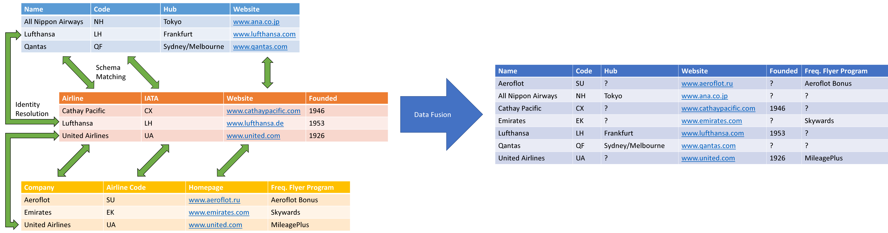

# Python Data Integration Framework (PyDI)

The PyDI framework provides methods for end-to-end data integration. The framework implements methods for data profiling, pre-processing, information extraction, normalization, schema matching, entity matching, data fusion, and result evaluation and reporting. The framework is designed as independent composable modules that operate on pure pandas dataframes as underlying data structure which makes its outputs fully compatible with third party packages using pandas. The methods in PyDI can be easily customized by passing building blocks such as pre-defined blockers, comparators, similarity functions, and conflict resolution functions. In addition, these building blocks can be used as a template to easily extend PyDI with additional data integration methods.

## Contents
- [Functionality](#functionality)
- [Contact](#contact)
- [License](#license)
- [Acknowledgements](#acknowledgements)

**Quick Start**: The section below provides an overview of the functionality of the PyDI framework. As alternatives to familiarizing yourself with the framework, you can also read the [PyDI Tutorial](/PyDI/tutorial/PyDI_Tutorial.ipynb) or have a look at the code examples in our [Wiki](/PyDI/wiki/)! 

## Installing PyDI

You can install PyDI via pip:

```
pip install uma-pydi
```

## Functionality
The PyDI framework covers all central steps of the data integration process, including data loading, pre-processing, schema matching, entity matching, as well as data fusion. This section gives an overview of the functionality and the alternative algorithms that are provided for each of these steps.



**[Data Loading](#)**: PyDI provides methods for reading standard data formats such as CSV, XML and JSON into pandas dataframes. All read methods can optionally assign a globally unique ID to each record if the dataset does not contain an ID column yet. PyDI's read methods further add optional provenance metadata to the dataframes using the `DataFrame.attrs` attribute.

**[Pre-processing](#)**: During pre-processing data is prepared for the methods that are going to be applied in the integration process. Pre-processing is a necessary step at each point in the data integration pipeline to ensure quality results. PyDI provides you with specialized pre-processing methods for tabular data, such as: 
- Information extraction via
    - Regex
    - Python functions
    - Large language models
- Value normalization 
    - Data type detection
    - Text & header normalization
    - Unit of measurement conversion
    - Anomaly detection
    - Data validation

**[Schema Matching](#)**: Schema matching methods find attributes in two schemata that have the same meaning. PyDI provides three pre-implemented schema matching algorithms which either rely on attribute labels or data values, or exploit an existing mapping of records (duplicate-based schema matching) in order to find attribute correspondences. PyDI's schema matching module offers:
- Label-based schema matching
- Instance-based schema matching
- Duplicate-based schema matching
- Evaluation and reporting for schema matching

**[Entity Matching](#)**: Entity matching methods identify records that describe the same real-world entity. The pre-implemented entity matching methods can be applied to a single dataset for duplicate detection or to multiple datasets in order to find record-level correspondences. PyDI offers a range of entity matching methods, starting from simple attribute similarity-based rules over machine-learned rules, to Pre-trained Language Models (PLMs) and Large Language Models (LLMs). Entity matching methods rely on blocking in order to reduce the number of record comparisons. PyDI provides the following pre-implemented blocking and entity matching methods: 
- Blocking by single/multiple blocking key(s)
- Sorted-neighbourhood blocking
- Token-based blocking
- Embedding-based blocking
- Rule-based entity matching (manual or machine learning-based)
- PLM-based entity matching
- LLM-based entity matching
- Evaluation and reporting for blocking and entity matching

**[Data Fusion](#)**: Data fusion methods combine data from multiple sources into a single, consolidated dataset. For this, they rely on the schema- and record-level correspondences that were discovered in the previous steps of the integration process. However, different sources may provide conflicting data values. PyDI allows you to resolve such data conflicts (decide which value to include in the final dataset) by applying different conflict resolution functions. PyDI's fusion module offers the following:
- 13 value-based conflict resolution functions for strings, numbers and lists
- 4 source-/provenance-based conflict resolution functions.
- Evaluation and reporting for Data Fusion

## Contact

If you have any questions, please refer to the  [PyDI Tutorial](/PyDI/tutorial/PyDI_Tutorial.ipynb), [Wiki](/PyDI/wiki/), and the [Documentation](#) first. For further information contact aaron [dot] steiner [at] uni-mannheim [dot] de and ralph [dot] peeters [at] uni-mannheim [dot] de

## License

The PyDI framework can be used under the [Apache 2.0 License](http://www.apache.org/licenses/LICENSE-2.0).

## Acknowledgements

PyDI is developed at the [Data and Web Science Group](http://dws.informatik.uni-mannheim.de/) at the [University of Mannheim](http://www.uni-mannheim.de/).